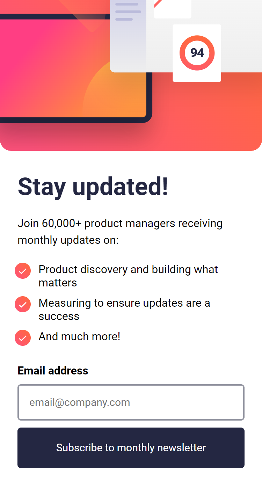

# Frontend Mentor - Newsletter sign-up form with success message solution by Afolabi John A. - Gentry Stack

This is a solution to the [Newsletter sign-up form with success message challenge on Frontend Mentor by Afolabi John A. - Gentry Stack](https://www.frontendmentor.io/challenges/newsletter-signup-form-with-success-message-3FC1AZbNrv). 

## Table of contents

- [Overview](#overview)
  - [The challenge](#the-challenge)
  - [Screenshot](#screenshot)
  - [Links](#links)
- [My process](#my-process)
  - [Built with](#built-with)
  - [What I learned](#what-i-learned)
  - [Continued development](#continued-development)
  - [Useful resources](#useful-resources)
- [Author](#author)
- [Acknowledgments](#acknowledgments)

## Overview

### The challenge

Users should be able to:

- Add their email and submit the form
- See a success message with their email after successfully submitting the form
- See form validation messages if:
  - The field is left empty
  - The email address is not formatted correctly
- View the optimal layout for the interface depending on their device's screen size
- See hover and focus states for all interactive elements on the page

### Screenshot

### Links

- Solution URL: [GitHub Repo](https://github.com/GentryHQ/newsletter-signup)
- Live Site URL: [Github Page Link](https://gentryhq.github.io/newsletter-signup/)

## My process

### Built with

- Semantic HTML5 markup
- CSS custom properties
- Flexbox
- Mobile-first workflow
- SASS/SCSS
- JS

### What I learned
- It has been a while since I wrote code because I've been busy in Nursing School, so I used this project to remind myself of the syntax, and getting back into shape. It turned out fun and very interesting, although I had problem remembering so stuffs which made it even more fun, because I'd to look it up and learnt more in the process.

- I actually had problem with get the email input value but with the help from a friend and some we surfing, we knocked it out!

### Continued development

I think in te future, I might actually add this form with a blog website I did sometime ago. 

## Author

- Website - [www.gentry.com.ng](https://www.gentry.com.ng)
- Frontend Mentor - [@GentryHQ](https://www.frontendmentor.io/profile/gentryhq)
- Twitter - [@iam_gentry](https://www.twitter.com/iam_gentry)

## Acknowledgments

Thanks to @a-simpa who helped with my JS-form Validation.
